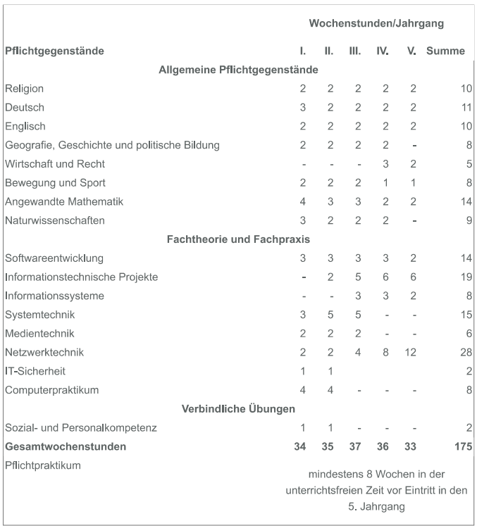
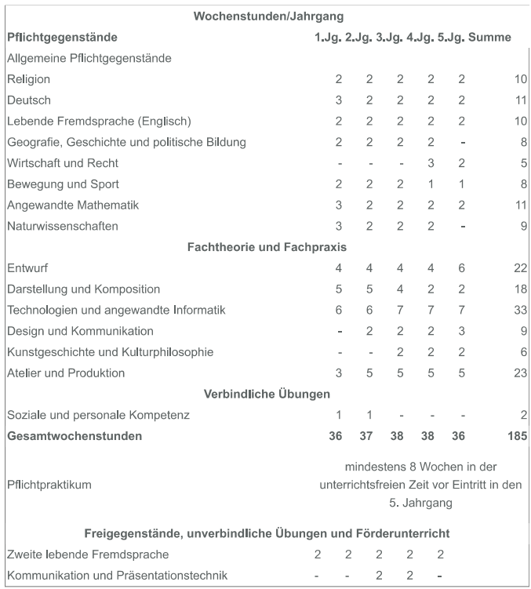
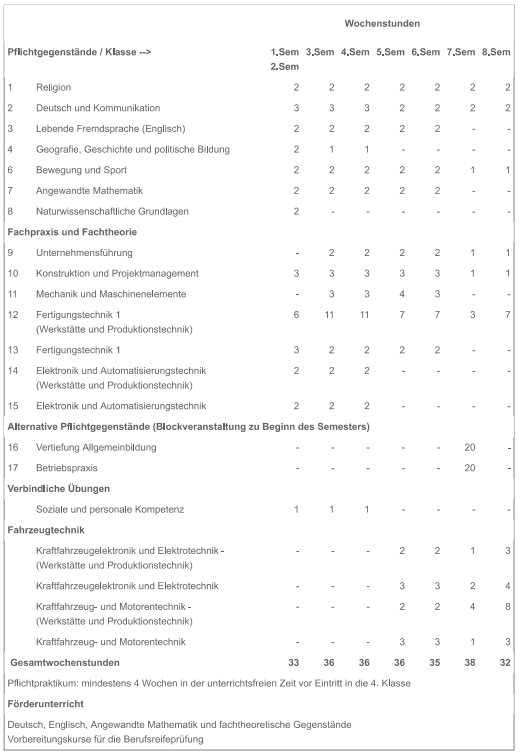
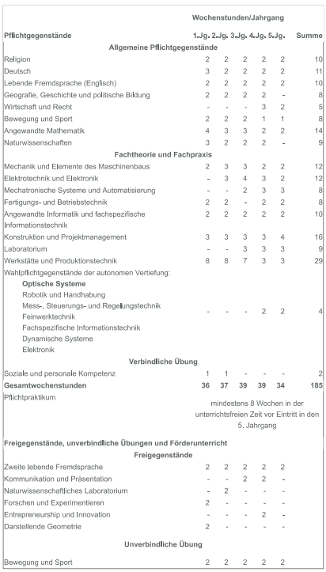

# Tag der offenen Tür
an der HTL Steyr

--

## Abteilungen

---

---

## Elektronik

> Die Zukunftstechnologien Elektronik und Technische Informatik sind Basis für

* Steuerungs- und Automatisierungstechnik,
* Telekommunikation und Mobilfunktechnik,
* Computer- und Netzwerktechnik, Sicherheits- und Fahrzeugtechnik,
* Medizin- und Umwelttechnik und vieles andere mehr.

---

## Informationstechnologie

> Die Ausbildung in Fachtheorie und Fachpraxis steht auf den Säulen

* Netzwerksicherheit und Netzwerkmanagement
* Softwareentwicklung
* Projekt- und Qualitätsmanagement
* Datenbanksysteme
* Informationsmanagement

---

## Art und Design

> Die höhere Lehranstalt für Art and Design teilt sich in drei Ausbildungsschwerpunkte

* Designorientierung
* Wirtschaftliche Basisausbildung
* Vermittlung fachlicher Kompetenz in Theorie und Praxis
* Zusammenarbeit mit der Wirtschaft
* fachorientierte Firmenbesuche
* Einblicke in Präsentation und Logistik von Ausstellungen

---

## Maschinenbau

> Technik, die bewegt!

Die KFZ-Abteilung der HTL Steyr bietet ihren Absolventen eine moderne Ausbildung, der ein überaus guter Ruf in der Industrie vorauseilt. Das enge Verhältnis zu allen Betrieben der Wirtschaft  ermöglicht der Abteilung, ständig am neuesten Stand zu bleiben, und dadurch den Schülern die bestmögliche Vorbereitung für das Berufsleben zu gewährleisten. Aus diesem Grund sind die Werkstätten und Laboratorien der Schule mit modernsten Mitteln ausgestattet.

---

## Mechatronik

> Mechatronische Produkte: intelligent, innovativ und allgegenwärtig

Kooperative Lehr- und Lernmethodenin allen Gegenständen fördern Kommunikationsfähigkeit, Kreativität, Zeitmanagement sowie Selbständigkeit und befähigen Absolventinnen und Absolventen in besonderem Maße für die Arbeit in fachübergreifenden Teams.

--

## Elektronik

---

## Stundentafel

<a data-permalink-href="images/Stundentafel_Elektronik.pdf" href="images/Stundentafel_Elektronik.pdf" id="raw-url" data-view-component="true" class="js-permalink-replaceable-link btn-sm btn BtnGroup-item">Download</a>

---

## Projekte

---

## Wahlmodule

* [Multimedia-Systeme & Web IT](https://htl-steyr.ac.at/index.php/abteilung-elektronik/multimedia-systeme-web-it)
* [Energiemanagement & Green IT](https://htl-steyr.ac.at/index.php/abteilung-elektronik/energiemanagement-green-it)

---

## Schnuppertage

...

--

## Informatik

---

## Stundentafel

<a data-permalink-href="images/Stundentafel_Informatik.pdf" href="images/Stundentafel_Informatik.pdf" id="raw-url" data-view-component="true" class="js-permalink-replaceable-link btn-sm btn BtnGroup-item">Download</a>

---

## Projekte

---

## Schnuppertage

...

--

## Art und Design

---

## Stundentafel

<a data-permalink-href="images/Stundentafel_Art_und_Design.pdf" href="images/Stundentafel_Art_und_Design.pdf" id="raw-url" data-view-component="true" class="js-permalink-replaceable-link btn-sm btn BtnGroup-item">Download</a>

---

## Projekte

---

## Schnuppertage

...

--

## Maschinenbau

---

## Stundentafel

<a data-permalink-href="images/Stundentafel_Maschinenbau.pdf" href="images/Stundentafel_Maschinenbau.pdf" id="raw-url" data-view-component="true" class="js-permalink-replaceable-link btn-sm btn BtnGroup-item">Download</a>

---

## Projekte

---

## Schnuppertage

...

--

## Mechatronik

---

## Stundentafel

<a data-permalink-href="images/Stundentafel_Mechatronik.pdf" href="images/Stundentafel_Mechatronik.pdf" id="raw-url" data-view-component="true" class="js-permalink-replaceable-link btn-sm btn BtnGroup-item">Download</a>

---

## Projekte
---

## Schnuppertage

...
