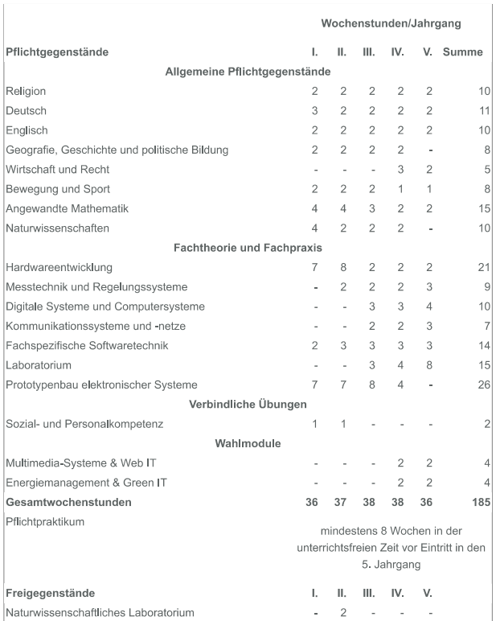

# Tage der offenen Tür 
an der HTL Steyr

--

## Abteilungen

---

---

## Elektronik

> Die Zukunftstechnologien Elektronik und Technische Informatik sind Basis für

* Steuerungs- und Automatisierungstechnik,
* Telekommunikation und Mobilfunktechnik,
* Computer- und Netzwerktechnik, Sicherheits- und Fahrzeugtechnik,
* Medizin- und Umwelttechnik und vieles andere mehr.

---

## Informationstechnologie

> Die Ausbildung in Fachtheorie und Fachpraxis steht auf den Säulen

* Netzwerksicherheit und Netzwerkmanagement
* Softwareentwicklung
* Projekt- und Qualitätsmanagement
* Datenbanksysteme
* Informationsmanagement

---

## Art und Design

> Die höhere Lehranstalt für Art and Design teilt sich in drei Ausbildungsschwerpunkte

* Designorientierung
* Wirtschaftliche Basisausbildung
* Vermittlung fachlicher Kompetenz in Theorie und Praxis
* Zusammenarbeit mit der Wirtschaft
* fachorientierte Firmenbesuche
* Einblicke in Präsentation und Logistik von Ausstellungen

---

## Maschinenbau

> Technik, die bewegt!

## gehört noch überarbeitet
* guter Ruf in der Industrie
* Technik am neuesten Stand
* bestmögliche Vorbereitung für das Berufsleben
* Mechanik und Maschinenelemente
* Elektronik und Automatisierung

---

## Mechatronik

> Mechatronische Produkte: intelligent, innovativ und allgegenwärtig

* fachübergreifend, themorientiert, umfassend
* Grundausbildung in Maschinenbau, Elektrotechnik/Elektronik und Informatik
* Maschinen- und Anlagenbau
* Medizintechnik
* Automobiltechnik

--

## Elektronik

---

## Stundentafel

<a data-permalink-href="images/Stundentafel_Elektronik.pdf" href="images/Stundentafel_Elektronik.pdf" id="raw-url" data-view-component="true" class="js-permalink-replaceable-link btn-sm btn BtnGroup-item">Download</a>

---

## Projekte

---

## Wahlmodule

* [Multimedia-Systeme & Web IT](https://htl-steyr.ac.at/index.php/abteilung-elektronik/multimedia-systeme-web-it)
* [Energiemanagement & Green IT](https://htl-steyr.ac.at/index.php/abteilung-elektronik/energiemanagement-green-it)

---

## Schnuppertage

* Freitag 27.01.2023
* Freitag 03.02.2023
* Freitag 10.02.2023
* Freitag 17.02.2023

--

## Informatik

---

## Stundentafel

<a data-permalink-href="images/Stundentafel_Informatik.pdf" href="images/Stundentafel_Informatik.pdf" id="raw-url" data-view-component="true" class="js-permalink-replaceable-link btn-sm btn BtnGroup-item">Download</a>

---

## Projekte

---

## Schnuppertage

* Freitag 27.01.2023
* Freitag 03.02.2023
* Freitag 10.02.2023
* Freitag 17.02.2023

--

## Art und Design

---

## Stundentafel

<a data-permalink-href="images/Stundentafel_Art_und_Design.pdf" href="images/Stundentafel_Art_und_Design.pdf" id="raw-url" data-view-component="true" class="js-permalink-replaceable-link btn-sm btn BtnGroup-item">Download</a>

---

## Projekte

---

## Schnuppertage

* Montag 16.01.2023
* Montag 23.01.2023
* Montag 30.01.2023
* Montag 06.02.2023
* Montag 13.02.2023

--

## Maschinenbau

---

## Stundentafel

<a data-permalink-href="images/Stundentafel_Maschinenbau.pdf" href="images/Stundentafel_Maschinenbau.pdf" id="raw-url" data-view-component="true" class="js-permalink-replaceable-link btn-sm btn BtnGroup-item">Download</a>

---

## Projekte

---

## Schnuppertage

* Mittwoch 21.12.2022
* Freitag 13.01.2023
* Freitag 27.01.2023
* Freitag 03.02.2023
* Freitag 10.02.2023
* Freitag 17.02.2023

--

## Mechatronik

---

## Stundentafel

<a data-permalink-href="images/Stundentafel_Mechatronik.pdf" href="images/Stundentafel_Mechatronik.pdf" id="raw-url" data-view-component="true" class="js-permalink-replaceable-link btn-sm btn BtnGroup-item">Download</a>

---

## Projekte
---

## Schnuppertage

* Freitag 27.01.2023
* Freitag 03.02.2023
* Freitag 10.02.2023
* Freitag 17.02.2023

--
## Allgemeines
* Führungen werden alle xxx Minuten gegeben
* Wahl zwischen Allgemeine Führung durch die Schule und einer Fachspezifischen, Schüler aller Abteilungen führen interessierte Besucher durch die Werkstätten, Labors und Konstruktionssäle. Beim Rundgang werden verschiedene Schulprojekte präsentiert.
* Option für einen digitalen Rundgang durch das Schulgebäude
